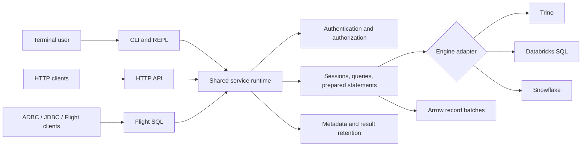
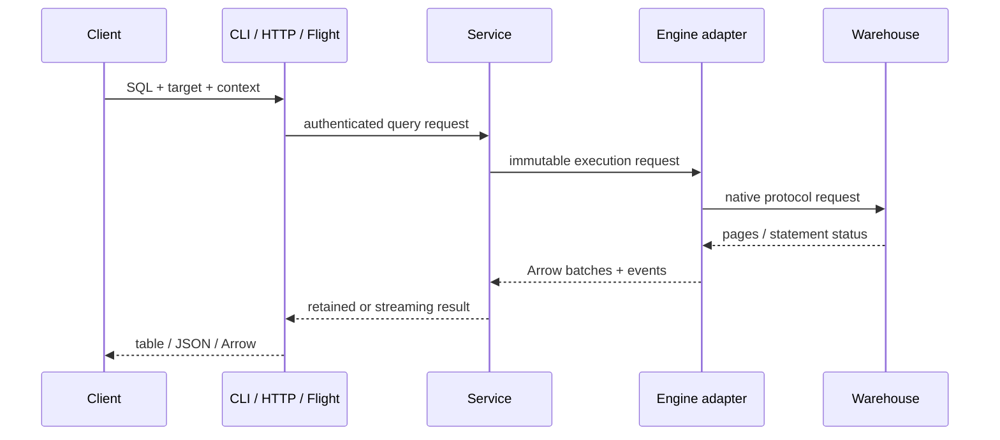

# Architecture

qcli is one product with three protocol-facing interfaces and one query core.
The terminal is not launched by the server, and Flight SQL is not translated
through HTTP.

## Layers

### Configuration

`qcli-config` discovers section-defined targets, applies `[default]`
inheritance, expands environment variables only when values are needed,
validates typed properties, checks secret-file permissions, and marks secrets
for redaction.

### Driver boundary

`qcli-driver-api` defines execution, metadata, capabilities, cancellation, and
session-update contracts. Engine crates translate native protocols and types
to Arrow without leaking their clients into the CLI or server front ends.

### Query and result core

`qcli-core` owns query events, cancellation, terminal state, bounded batch
streaming, and stable error classification. `qcli-output` renders human or
machine formats from the same Arrow data.

### Service runtime

`qcli-service` owns principal-bound sessions, query status, prepared handles,
typed parameters, result paging, retention, and shutdown. HTTP and Flight SQL
call this contract directly.

### Protocol front ends

`qcli-http` provides OpenAPI-described REST resources, JSON/CSV/NDJSON/Arrow
results, SSE events, auth middleware, quotas, audit, and health endpoints.
`qcli-flight-sql` implements Flight discovery, standard SQL info, sessions,
metadata, statements, prepared statements, ingestion, and signed tickets.

### Optional cluster layer

`qcli-cluster` moves mutable coordination to PostgreSQL and immutable retained
Arrow data to an object store. Leases and monotonic fencing prevent a stale
node from mutating work after failover.

## Execution paths

## Extension model

- New engine: implement the adapter and capability/metadata contracts.
- New identity flow: implement a credential/authentication provider without
  changing query execution.
- New protocol: consume `qcli-service`; do not call a warehouse directly.
- New coordinator or result store: implement the cluster/store interfaces and
  preserve ownership, expiry, versioning, and fencing invariants.

## Trust boundaries

The gateway authenticates the caller before target access, binds every mutable
or retained resource to the principal, and authorizes the target again at
execution. Warehouse credentials remain server-side. TLS termination is either
inside Flight or at an explicitly trusted proxy; forwarded transport headers
are ignored unless that mode is enabled.
