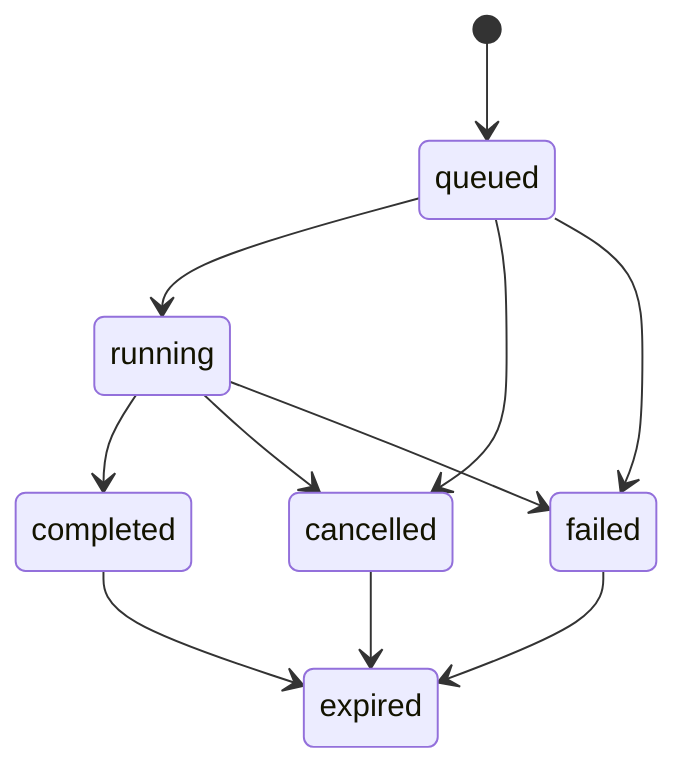

# Sessions, queries, and results

## Targets and sessions

A target is saved connection configuration. A session is a principal-owned,
versioned snapshot of a selected target and mutable context such as catalog,
schema, and session properties.

The CLI creates a session automatically. HTTP and Flight clients may create a
persistent session or submit stateless work. Stateless HTTP queries use a
short-lived internal session but still pass through the same ownership and
authorization path.

## Query lifecycle

Submission returns an opaque qcli query ID. Adapters may also retain the native
engine query ID for diagnostics and cancellation. Query status and events are
available independently of result consumption.

## Arrow as the result contract

Adapters produce bounded Arrow record batches. Human table formatting may
round decimals or truncate strings; source values remain unchanged. Machine
formats serialize exact values. HTTP can return JSON, NDJSON, CSV, or Arrow;
Flight SQL streams Arrow directly.

Large retained results spill to Arrow IPC rather than accumulating without
bound in memory. Result limits fail explicitly. In cluster mode, immutable
Arrow IPC objects are shared through the configured object store.

## Cancellation

Cancellation is cooperative and adapter-capability dependent. ConfluxQuery publishes a
cancellation request, reports progress through query events, and only claims
confirmed engine cancellation when the adapter can establish it. Inspect
`target capabilities` before building an operational guarantee around cancel.

## Prepared statements and parameters

Flight SQL prepared handles are opaque, expiring, and principal-bound. Typed
Arrow parameter batches are retained by the service. Closing or expiry removes
the handle; another principal cannot use it. Engines that do not expose native
parameter binding may receive safely rendered native SQL according to adapter
rules.

## Retention and expiry

Sessions, prepared statements, queries, and results have bounded lifetimes.
Expired resources return not-found at protocol edges. Ownership mismatches use
the same outward behavior to avoid revealing another caller's resources.
