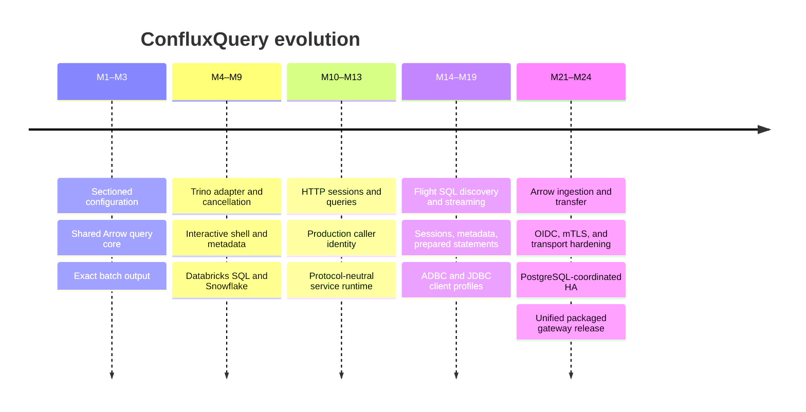

# Product evolution

ConfluxQuery evolved by extracting reusable product boundaries before adding new
protocols. This sequence matters: the gateway is not an HTTP wrapper around a
terminal process.

## From shell to reusable query core

The first milestones established section-defined targets, default inheritance,
typed validation, secret expansion, a driver interface, Arrow batches, and
bounded streaming. That made interactive and batch output consumers of the
same execution events.

## From one engine to three

Trino established real remote execution and cancellation. Databricks SQL and
Snowflake then proved the adapter boundary against different protocols,
authentication models, command responses, type systems, and catalog semantics.
The conformance layer captures the common minimum rather than forcing every
engine into Trino behavior.

## From local client to gateway

HTTP introduced persistent sessions, asynchronous queries, pagination, SSE,
cancellation, retention, caller authentication, ACLs, quotas, and audit. Those
capabilities were moved into a protocol-neutral service crate before Flight SQL
was added.

## Arrow-native interoperability

Flight SQL exposes the same service through a standard Arrow protocol. The
implementation grew through discovery, queries, sessions, target-aware
metadata, prepared statements, updates, ingestion, large-result endpoints,
and tested ADBC/JDBC clients.

## Enterprise operation

OIDC, mTLS, rotation, proxy enforcement, and per-principal limits hardened the
edge. Optional cluster mode then added PostgreSQL coordination, leases,
fencing, shared sessions and prepared statements, object-backed retained
results, distributed quotas, draining, and node-independent signed tickets.

## What comes next

- M20 remains an experimental ODBC/BI workstream until named clients are
  repeatably certified.
- M25 delivered the separately versioned, branded Type 4 ConfluxQuery JDBC
  Driver and its `jdbc:qcli://` contract.
- The feature roadmap includes query routing, policy, observability, result
  caching, and dialect-aware transpilation.

The detailed engineering trail remains available in the
[execution plan](../execution-plan.md), but product documentation describes the
current coherent system rather than requiring users to reconstruct it from
milestones.
